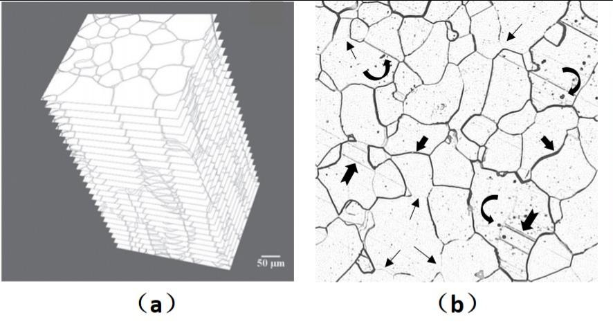

# Iron Grain Data sets
In material science, the inner structure of a material is called its micro-structure. It stores the genesis of a material and determines all the physical and chemical properties. Among all the material, polycrystalline structure are commonly used and studied in practice.

Recently progress in material microscopic image semantic segmentation has been driven by high-capacity models trained on large data sets. However, unlike public data in nature science and biological image, the produce and label of image data is very time-consuming. Because the opacity of material, scientist can only use serial section method to obtain the 2D images of material. Besides, the image may suffer many flaws during sample preparation, which make the labeling process consume much more times than other image data. In total, we think the progress of material microscopic image processing is hindered by the lack of public data.

Therefore, we public our data sets with its label in order to provide a referenced data sets for computer vision community.

We provide two types of data:

(1) The real data produced and collected in practical experiment.

(2) The virtual data generated by monte carlo potts model.

## Real data set
The specimen was intercepted from a hot-rolled iron slab and forged into round bars with a diameter equals to 30 mm. The pure iron bars were then fully recrystallized by annealing at 880 °C for 3 h to gain uniform grain microstructures in two dimensions. The samples were polished for a fixed time, and each polished layer was etched with 4vol% nital solution in preparation for optical microscopy. Images of microstructure were collected by an optical microscope, and a total of 296 serial sections with an average section thickness of 1.8 \mu m were obtained. We used Leica VMHT 3000 Victorinox microhardness tester to produce two sets of points, which meant that new points were struck before the previous ones disappeared to mark for image alignment and control the thickness of each section. This procedure effectively ensured that the images of the same area of interest were collected.

Unlike public data in nature science and biological image, the material microscopic image often suffer many flaws during sample preparation. As shown in Figure, (a) is the stack of serial sections for polycrystalline iron. (b) is one slice of metallographic image, it contains grain boundaries (straight and thick arrows), vague or missing boundaries (straight and thin arrows), noise (curved arrows) and spurious scratches (notched arrows).(c) is labeling result of (b) and (d) is boundary detection result of (b).

The reasons of those flaws:

Vague or missing boundary: caused by incomplete etching in 4vol% nital solution. The boundary could be recovered by information of neighbor slices

Noise: caused in sample preparation.

Spurious scratches: unavoidably caused in polished process, which is similar to boundary and introduce difficulty in image processing.

The real image data set consists of 296 images, with resolution of 2560 \times 1600

## Virtual data set
We generate virtual image data by using monte Carlo Potts model to mimic the grown procedure of material grain.

We public the data obtained at 5000 monte carlo step of simulation process

## Downloading of data
The data sets could be downloaded at:

## Usage of data
The data is stored in TIF data type. We provide python code to read them.

## Citation
If you use our data sets, please consider citing:

[1] Wait for updating

In addition, if you use the real data set, please consider citing:

[2] Xue, W.H. Three-dimensional modeling and quantitative characterization of grain structure[D].Beijing: University of science and technology Beijing, 2016.

[3] Feng, M.N., Wang, Y.C., Wang, H., Liu, G.Q., Xue, W.H. Reconstruction of three-dimensional grain structure in polycrystalline iron via an interactive segmentation method[J]. International Journal of Minerals Metallurgy and Materials, 2017(03):31-37.

In addition, if you use the virtual data set, please consider citing:

[4] Qin X.G., Liu, G.Q. Large-Scale 3D Model and Quantitative Characterization of Grain Microstructure Based on Monte Carlo Potts Simulation[J]. Journal of University of Science & Technology Beijing, 2004(2):192-192.

## Acknowledgements
The authors acknowledge the financial support from the National Key Research and Development Program of China (No. 2016YFB0700500)